# Figures

Generated by `viz/make_figures.py` from the runs of dataset `ec7b516efa` (35 models: linear-bin-s2, linear-ord0.25-s2, linear-ord0.5-s2, linear-ord1-s2, linear-ord2-s2, mlp256-bin-s2, mlp256-ord0.5-s2; + baselines). Reference (validation-selected) = `mlp256-ord0.5-s2/lme` (out-of-fold macro AP 0.856); per-pooler figures use `mlp256-ord0.5-s2`. CIs: block bootstrap over 3-day blocks within recording regimes, B=2000, paired. Do not edit by hand; rerun `frog run figures`.

## 01_bag_structure

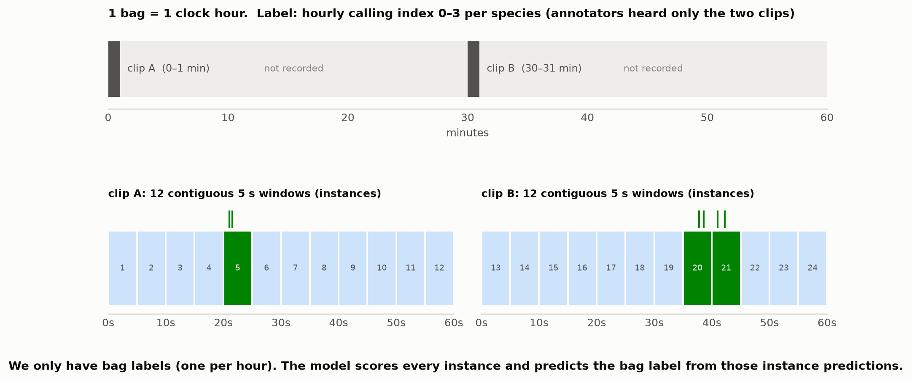

How an hour becomes a MIL bag: two 1-min clips per hour (2019), each tiled into 12 contiguous 5 s windows (instances). Nov–Dec 2018 hours have one clip (12 windows) and Sep–Oct 2018 hours three (36 windows, 8 kHz). Labels exist only per bag. The model predicts the bag label from its instance predictions.

## 02_pipeline

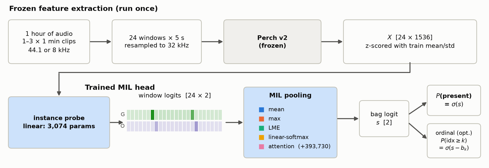

Model pipeline: frozen Perch v2 embeddings per 5 s window, a per-window probe, a pooling function that turns the window logits (12, 24 or 36 per hour, by recording regime) into one bag logit per species, and an optional cumulative-link ordinal head on that same logit.

## 02_pipeline_wytham

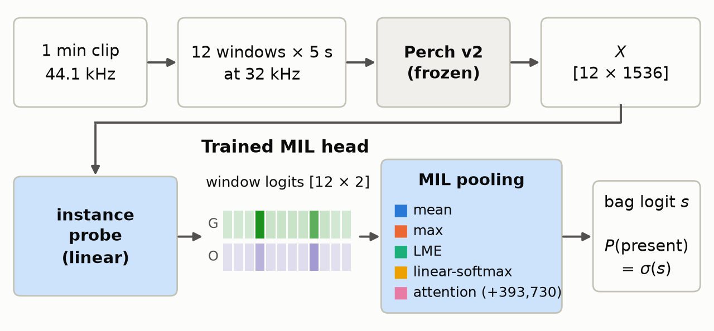

Slide version of the pipeline for a single 1 min recording (12 windows): frozen Perch v2 embeddings per 5 s window, a per-window probe, and a pooling function that turns the window logits into one bag logit per species.

## 03_pooling_toy

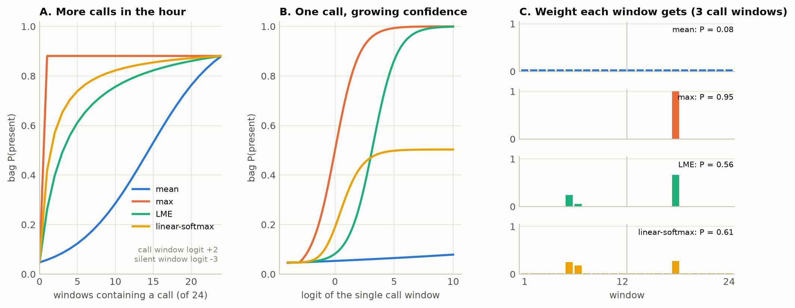

How the fixed poolers turn window logits into a bag score, using the project's own pooling code on toy inputs (call windows logit +2, silent -3; C has 3 call windows). Mean needs calls to fill the hour. Max reacts to one confident window but gives gradient to that window only. LME and linear-softmax sit in between. Attention is learned, so it is shown on real data in figure 10.

## 04_calendar

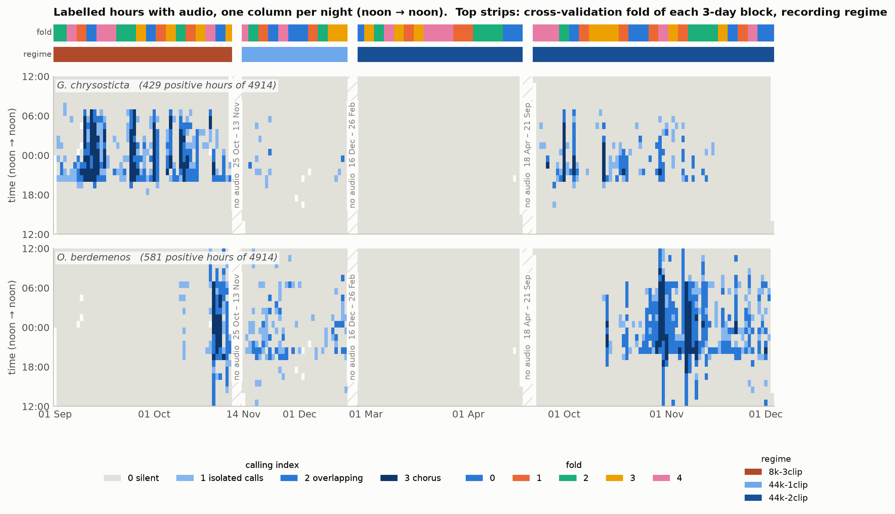

Every labelled hour with audio, coloured by calling index, for each species. Each column is one night (noon to noon), so a night of calling is one contiguous band. Stretches of more than a week without audio are collapsed into a hatched break. The top strips show the cross-validation fold of each 3-day block and the recording regime: Sep–Oct 2018 at 8 kHz with three 1 min clips per hour, Nov–Dec 2018 at 44.1 kHz with one, and Feb–Apr and Sep–Dec 2019 at 44.1 kHz with two. Both frogs call at night and neither calls in the Feb–Apr recordings.

## 05_forest_ap

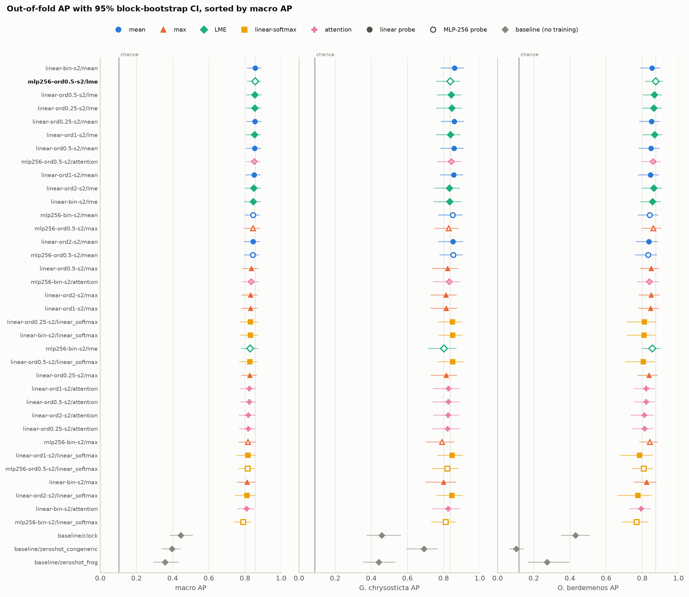

Out-of-fold average precision for every model and baseline (every hour is scored by the cross-validation model that never saw it), seed-averaged, with a 95% block-bootstrap CI (3-day blocks resampled within each recording regime). The bold label and faint vertical line mark the validation-selected reference model. Colour and marker show the pooler, and hollow markers are the MLP probe.

## 06_effects

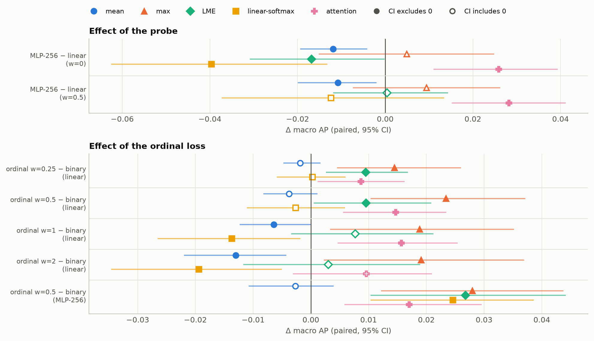

Controlled comparisons: each Δ compares two models that differ in one factor only (probe or ordinal loss weight), with the same pooler, splits and seeds. Filled markers are CIs that exclude 0.

## 07_ordinal_sweep_linear

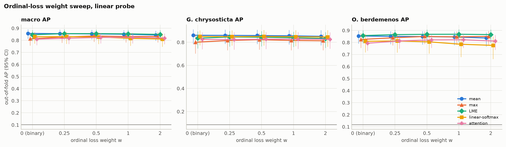

Out-of-fold AP against the ordinal loss weight w for the linear probe. Points are dodged sideways so the CIs stay readable. The grey line is chance. Use `effects` for paired Δ vs w = 0.

## 08_per_index

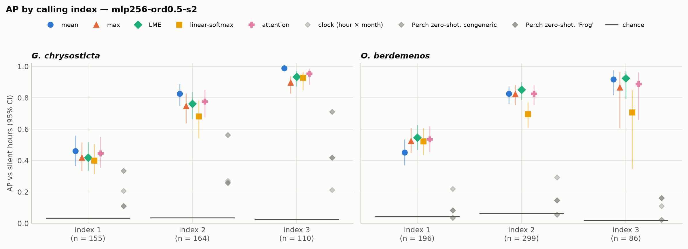

AP of each calling index against silent hours, for every pooler in `mlp256-ord0.5-s2` and the baselines (grey diamonds). Short dark bars are chance. Index 1 (isolated calls) is the hard, pooling-sensitive case.

## 09_val_vs_test

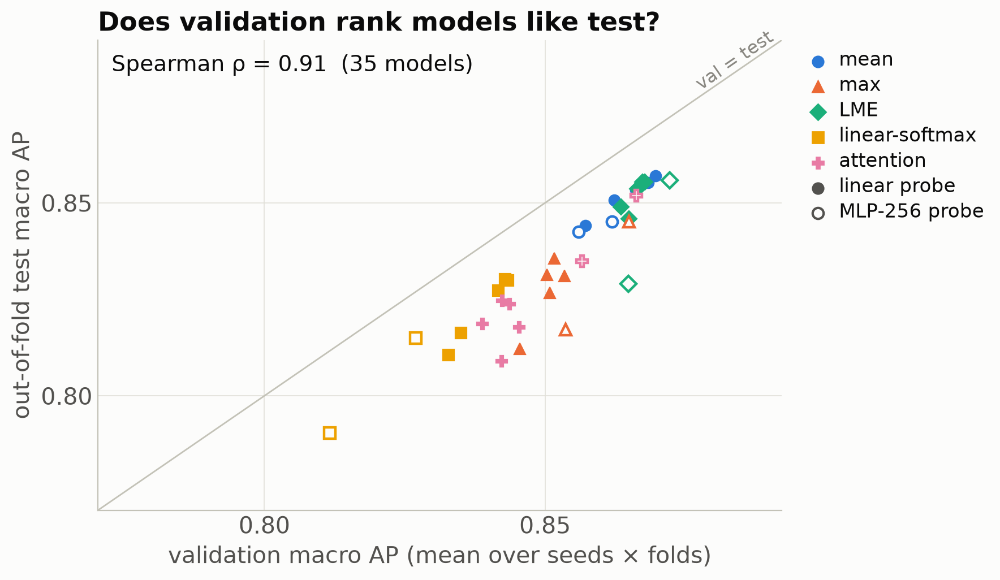

Validation vs out-of-fold test macro AP per model. Validation AP is each fold model's early-stopping optimum on its validation fold, averaged over folds and seeds, so it is optimistic. The report selects its reference model on this axis; a weak rank correlation means that choice is close to arbitrary among the top models.

## 10_pooling_example

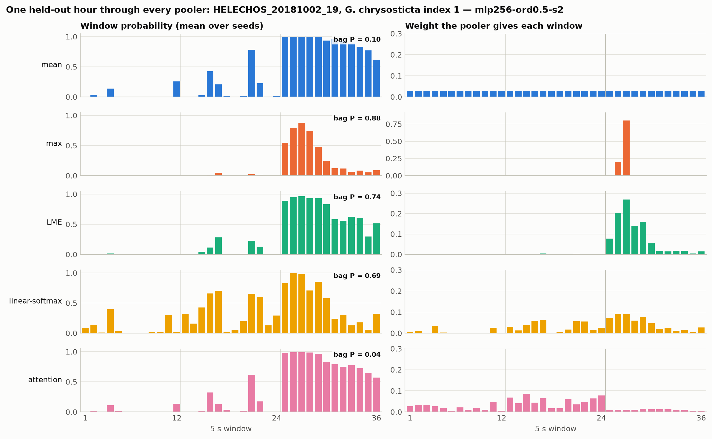

A real hour (`HELECHOS_20181002_19`, *G. chrysosticta* index 1), scored by the cross-validation models that never saw it, chosen automatically as the hour where the poolers disagree most. Left: each model's per-window probability. Right: the weight its pooler put on each window (max is one-hot, mean is uniform, attention is learned from the embedding).

## 10_pooling_example_wytham

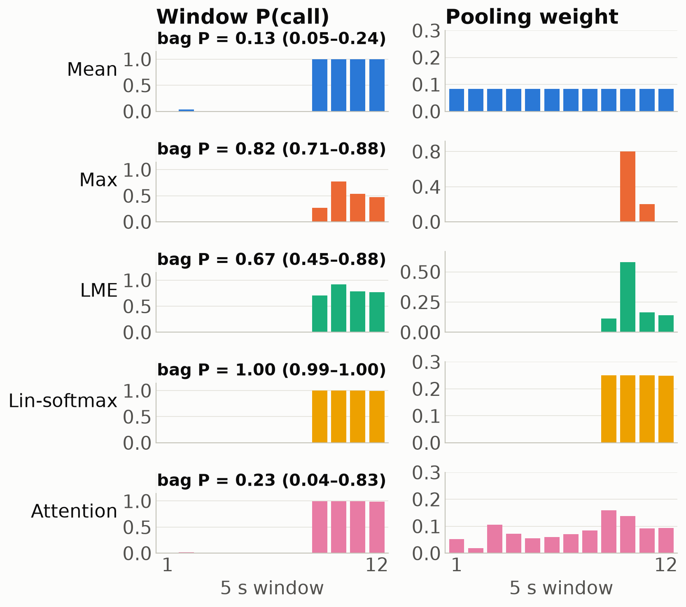

A real hour (`HELECHOS_20191013_19`, *G. chrysosticta* index 1), scored by the cross-validation models that never saw it, chosen automatically as the hour where the poolers disagree most. Left: each model's per-window probability. Right: the weight its pooler put on each window (max is one-hot, mean is uniform, attention is learned from the embedding). Only the first 12 windows (the first 1 min clip) are used: later windows are masked, so weights and bag P are for that clip alone. Bars and bag P are means over the training seeds; the bracket is the range of bag P across seeds.

## 11_forest_simple

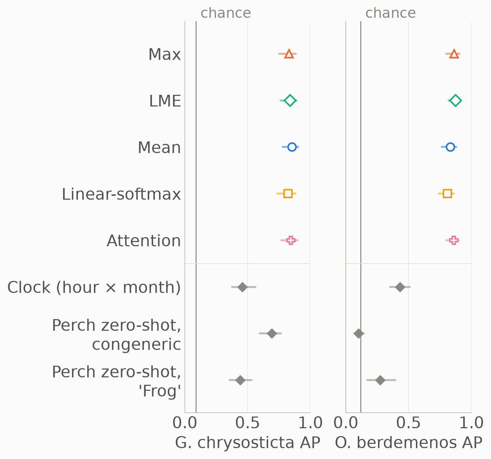

Simplified forest plot for slides: out-of-fold AP per species for each pooler in `mlp256-ord0.5-s2` (colours as in figure 5) and the three baselines (grey), as seed-averaged AP with a 95% block-bootstrap CI.

## 12_per_regime

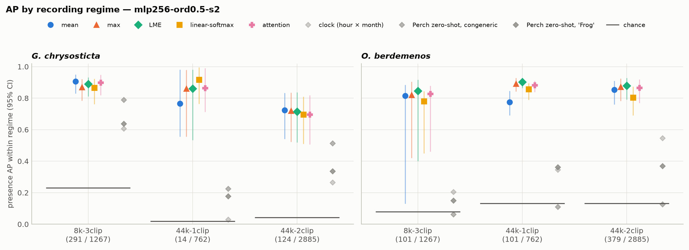

Presence AP within each recording regime for every pooler in `mlp256-ord0.5-s2` and the baselines (grey diamonds); tick labels give positive / total hours. `8k-3clip` = 8 kHz, three 1 min clips per hour (Sep–Oct 2018); `44k-1clip` = 44.1 kHz, one clip (Nov–Dec 2018); `44k-2clip` = 44.1 kHz, two clips (2019). Short dark bars are chance, which differs between regimes, so compare each group with its own bar.
